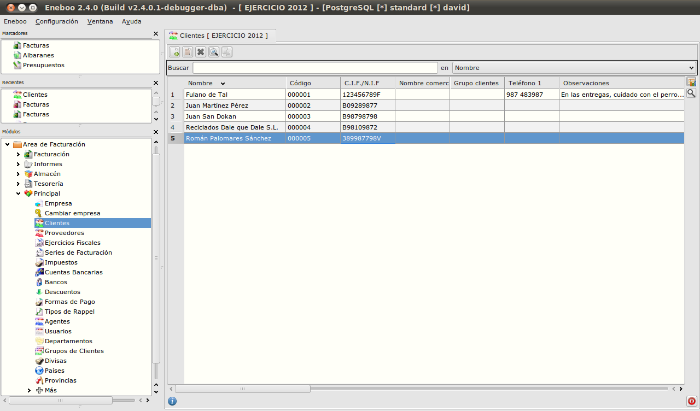

==============================
Área de facturación
==============================

Introducción
-----------------------------------

En este área se gestiona todo lo que tiene que ver con procesos de compra y de venta. Los documentos que se manejarán serán presupuestos, pedidos, albaranes y facturas. Además, en este área se encuentran muchos datos fundamentales para la empresa como los clientes, proveedores y artículos.

Facturación
-----------------------------------

Principal
-----------------------------------

Clientes
""""""""""""""

Aquí vamos a introducir todos los datos relacionados con los clientes de la empresa. Esta información será la que se utilizará para todas las gestiones asociadas con ellos: entrada de albaranes, facturas, tesorería, etc.

A continuación como ejemplo se verá el diseño de una ficha de un cliente. Seleccionar el menú *Área de Facturación → Principal → Clientes* (doble clic).

La parte superior muestra los botones disponibles que se detallan a continuación:

- *Insertar registro*: Se utiliza para dar de alta fichas. Desde el teclado pulsando tecla A.
- *Modificar registro*: Se utiliza para modificar datos de una ficha. Desde el teclado pulsando tecla M.
- *Eliminar registro*: Se utiliza para eliminar la ficha ya existente. Desde el teclado pulsando tecla E.
- *Ver registro*: Se utiliza para abrir la ficha del cliente y ver los datos. Desde el teclado pulsar tecla I.
- *Copiar registro*: Se utiliza para crear un duplicado del cliente seleccionado. Desde el teclado pulsar tecla C.

Almacén
-----------------------------------

Tesorería
-----------------------------------

Informes
-----------------------------------
