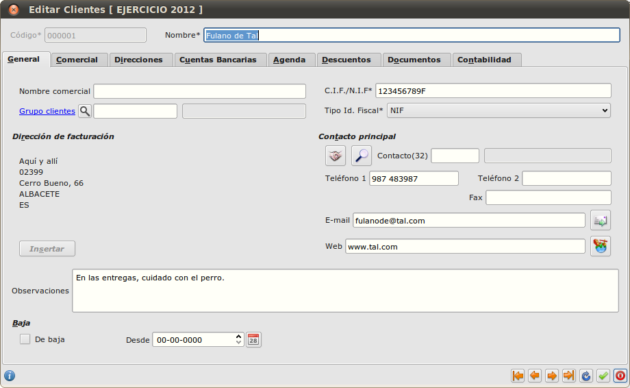
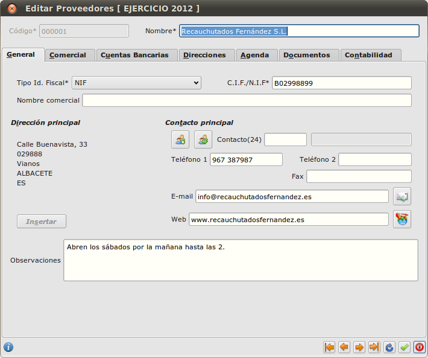
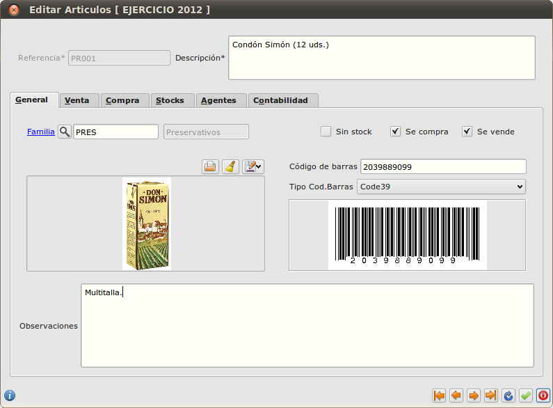

==============================
Área de facturación
==============================

Introducción
-----------------------------------

En este área se gestiona todo lo que tiene que ver con procesos de compra y de venta. Los documentos que se manejarán serán presupuestos, pedidos, albaranes y facturas. Además, en este área se encuentran muchos datos fundamentales para la empresa como los clientes, proveedores y artículos.

Facturación
-----------------------------------

Principal
-----------------------------------

Clientes
""""""""""""""

Aquí vamos a introducir todos los datos relacionados con los clientes de la empresa. Esta información será la que se utilizará para todas las gestiones asociadas con ellos: entrada de albaranes, facturas, tesorería, etc.

A continuación como ejemplo se verá el diseño de una ficha de un cliente. Seleccionamos el menú *Área de Facturación → Principal → Clientes* (doble clic).

.. figure:: images/master_clientes.png
   :width: 800 px

La parte superior muestra los botones disponibles que se detallan a continuación:

- *Insertar registro*: Se utiliza para dar de alta fichas. Desde el teclado pulsando tecla A.
- *Modificar registro*: Se utiliza para modificar datos de una ficha. Desde el teclado pulsando tecla M.
- *Eliminar registro*: Se utiliza para eliminar la ficha ya existente. Desde el teclado pulsando tecla E.
- *Ver registro*: Se utiliza para abrir la ficha del cliente y ver los datos. Desde el teclado pulsar tecla I.
- *Copiar registro*: Se utiliza para crear un duplicado del cliente seleccionado. Desde el teclado pulsar tecla C.

A continuación se detalla paso a paso cómo se realiza la entrada de una ficha de un cliente.

Las casillas con asterisco (*) se deben de rellenar obligatoriamente.

El código de cliente se puede cambiar o de lo contrario utilizará el código que Eneboo asigna por 
defecto.

**General**

Dentro de la pestaña *General* rellenamos los datos más generales del cliente como por ejemplo el tipo de identificación (NIF, pasaporte, Certificado de residencia...) y el número. Teléfonos, fax,  e-mail, web...
En *Grupo de clientes* ponemos, en su caso, si el cliente pertenece a un grupo, por ejemplo: Cliente Habitual y si le aplicamos una tarifa especial.
Pulsando el botón *Insertar* se nos abre una ventana para incluir la dirección del cliente.
En *Observaciones* podemos indicar cualquier dato a tener en cuenta.
Si marcamos la casilla *De baja*, tenemos que indicar la fecha y este cliente no lo podemos utilizar para generar cualquier documento como albaranes, facturas, etc.

**Comercial**

Será donde se indiquen sus condiciones comerciales, formas de pago, moneda, serie de facturación, 
IVA, etc... Con estos datos y los días de pago, Eneboo calcula la fecha de los vencimientos. También podemos insertar el agente que lleva su ficha.

**Direcciones**

En este apartado se pueden indicar si el cliente dispone de varias direcciones, como por ejemplo, dirección de facturación, dirección fiscal...

**Cuentas Bancarias**

En caso de que el cliente pueda tener varias domiciliaciones bancarias para la tramitación de los recibos, serán indicadas en esta sección.

**Agenda**

En este apartado se indican las personas de contacto. En la parte superior derecha aparecen dos “clips”. El de color azul es para asociar a un contacto y el rojo para eliminar asociación.

**Descuentos**

Será donde se indique si a este cliente se le aplica algún descuento a parte.

**Documentos**

En este apartado podemos visualizar todos los documentos generados a este cliente, como pueden ser *Presupuestos*, *Pedidos*, *Albaranes*, *Facturas* o *Recibos*.

**Contabilidad**

Se informará en esta sección de los datos fiscales y las cuentas contables para su posterior trabajo en contabilidad.

Para finalizar y guardar todos los datos en la parte inferior derecha hacemos clic en el símbolo verde.

Proveedores
"""""""""""""""""""

Los datos de los proveedores más adelante se utilizan para todas las gestiones asociadas con ellos, como entrada de albaranes, facturas, contabilidad, etc.

Para abrir la lista de proveedores seleccionamos el menú *Área de Facturación → Principal → Proveedores* (doble clic).

La gestión de proveedores (insertar, modificar, eliminar, etc.) se hace de igual forma que se ha explicado para la gestión de Clientes_.

A continuación se muestra una ficha de proveedor.

Almacén
-----------------------------------

Artículos
"""""""""""""

Para acceder a la gestión de artículos haremos doble clic en la opción de menú *Área de facturación -> Almacén -> Artículos*. En este apartado aparece la relación de artículos que hemos dado de alta. Al igual que en cualquier lista de datos podemos crear un artículo nuevo, modificar, borrar, ver, duplicar, etc., como se ha explicado para los Clientes_.

La ficha de artículo es como se muestra a continuación.

En el cuadro de *Referencia* indicamos la referencia o código del artículo y a continuación la descripción.

Tenemos varias pestañas: *General*, *Venta*, *Compra*, *Stocks*, *Agentes*, y *Contabilidad*.

**General**

Aquí indicamos la *Familia* a la que pertenece, en el caso de que pertenezca a alguna. La clasificación de los artículos en familias puede resultar muy útil para generar listados de artículos de cualquier tipo.

Si el artículo no necesita cotrol de stock, como por ejemplo las horas de trabajo, marcamos la casilla de *Sin stock*. De esta manera cada vez que hagamos un albarán, no descontará stock de este artículo.

También podemos indicar si este artículo *Se compra* o *Se vende*. Al marcar cada una de las opciones se habilita o deshabilita la pestaña correspondiente.

Podemos añadir una imagen a partir de un archivo.

El campo *Código de barras* se utiliza si se usa un lector de códigos de barras.

Y en el apartado *Observaciones* podemos indicar cualquier anotación sobre este artículo.

**Venta**

En esta pestaña indicaremos el precio de venta del artículo. En caso de necesitar varios precios de venta, por ejemplo tarifas de distribuidor, de grandes almacenes, clientes finales, etc. utilizaremos las tarifas. Si tenemos tarifas creadas, al pinchar en *Generar precios* nos aparecerán los distintos precios.

También especificaremos el tipo de IVA de este artículo.

**Compra**

En esta pestaña vamos a indicar los proveedores que suministran este artículo y el precio de coste de 
cada uno de ellos.

**Stocks**

Aquí indicaremos el stock mínimo y máximo. También podemos marcar *Permitir ventas sin stock* para que, en el caso de que no tengamos stock, podamos hacer un albarán o factura.

**Agentes**

En caso de existir agentes, aquí podemos asignarle sus comisiones por la venta de este artículo.

**Contabilidad**

En este apartado podemos especificar la *Subcuenta de compras*, la *Subcuenta de ventas* y el *IRPF de Compras*.

Tesorería
-----------------------------------

Informes
-----------------------------------
