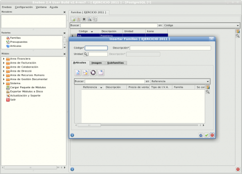

===============================================
Cómo colaborar en la edición de este manual
===============================================

Este manual está siendo desarrollado por la Comunidad Eneboo. Si estás interesado en colaborar con la creación del mismo, en este capítulo puedes encontrar cómo hacerlo.

Descargar los fuentes
---------------------------

Los fuentes del manual de Eneboo Standard se encuentran en un repositorio_ en GitHub. Si deseas colaborar con la edición del manual deberás darte de alta en GitHub y crear un fork. Sigue estos pasos:
    1. Si no tienes cuenta en GitHub, `date de alta <https://github.com/signup/free>`_.
    2. `Configura git <http://help.github.com/set-up-git-redirect>`_.
    3. `Haz un fork <http://help.github.com/fork-a-repo/>`_ de este repositorio_ y descárgalo con::
    
         $ git fetch upstream
    

Instalar Sphinx
--------------------
Para generar tanto HTML como PDF usaremos Sphinx_. Para instalarlo has de hacer lo siguiente:
    1. Instalar python (cualquier versión a partir de la 2.6). Para Windows y Mac hay que descargar un `instalador <http://www.python.org/getit/>`_. En el caso de Linux, búscalo en el gestor de paquetes de tu distribución.
    2. Instalar Sphinx. Dependiendo de tu sistema operativo, sigue las instrucciones para instalación en `Windows <http://sphinxsearch.com/docs/1.10/installing-windows.html>`_ o `Mac <http://freelancing-god.github.com/ts/en/installing_sphinx.html>`_. En el caso de Linux, como en el punto anterior, acude al gestor de paquetes de tu distribución.

Editar los capítulos
-----------------------------

Cada capítulo del manual se encuentra en un fichero distinto. Los ficheros de la documentación están en formato reStructuredText_ (``.rst``). Para editarlos se puede utilizar cualquier editor de texto simple como el *Bloc de Notas*, *gedit*, *kate* o cualquier otro.

Para empezar a desarrollar un capítulo que ya esté en el índice debes buscar el fichero correspondiente en la carpeta donde hayas descargado el repositorio. Los nombres de los ficheros son bastante descriptivos. Simplemente ábrelo y ve completándo. Si necesitas una orientación puedes consultar el apartado `Recursos adicionales`_.

Necesitarás saber cómo poner títulos, imágenes, etc. Consulta el apartado `Formateando el texto`_.

Modificar el índice
--------------------------

En Sphinx, el índice de capítulos se llama *toctree* (*table of contents tree*). Para modificarlo hay que editar el fichero ``index.rst`` y modificar las opciones de la directiva *toctree*::

    .. toctree::
        :maxdepth: 2
   
        introduccion
        instalacion
        config

La lista de nombres que aparecen debajo de *:maxdepth: 2* corresponden a ficheros que contienen la documentación de cada uno de los capítulos del manual. Todos estos ficheros deben tener sufijo ``.rst`` y estar escritos en lenguaje reStructuredText_, aunque el sufijo ``.rst`` NO debe incluirse en la lista de la directiva *toctree*.

En resumen, para añadir capítulos al índice basta con incluir el nombre del fichero SIN el sufijo ``.rst`` en la lista de la directiva *toctree* del fichero ``index.rst``.

Formateando el texto
----------------------

A continuación se detalla el subconjunto de marcas de reStructuredText_ que se usará para formatear el texto:

**El título del capítulo** debe aparecer al principio de cada fichero de capítulo. Por encima y por debajo de éste se debe incluir una línea de símbolos de igual (\=) de la siguiente forma::

    ===========================================
    Primeros pasos
    ===========================================
        
**Las secciones**, es decir, los distintos apartados de cada capítulo, tendrán debajo del texto una línea de guiones (\-), como por ejemplo::
    
    Editar líneas de una factura
    -------------------------------
    
**Las subsecciones** se marcarán escribiendo debajo del título una línea de comillas (\"), como se ve a continuación:

    

**Los elementos propios de la aplicación**, como nombres de campos o botones, deberán ir *en cursiva* para distinguirlos mejor. Para hacer esto, se pondrán entre dobles asteriscos, como se puede ver a continuación::
    
    Para crear una nueva factura pulse el botón \*Insertar registro*.
        

**Enlaces dentro del manual**

Para crear un enlace a otra sección del manual se utiliza la directiva *doc* seguida del nombre del fichero correspondiente sin el sufijo ``.rst`` de la siguiente forma::

    El manual se encuentra en proceso de desarrollo, por lo que algunas partes pueden aparecer incompletas. Si desea
    colaborar en su edición vea :doc:`aquí <como_colaborar>` cómo hacerlo.

Para crear un enlace a una sección dentro de un capítulo se escribe el título del mismo de la siguiente forma::

    Si necesitas una orientación puedes consultar el apartado `Recursos adicionales`_.

**Enlaces externos**
      
Para incluir un enlace a una URL externa a la documentación, el texto del enlace debe ir seguido de un guión bajo (\_). Si el texto del enlace está compuesto de más de una palabra, todo el texto debe ir entre tildes (\`). Al final del documento, se definirán todas las URL externas del documento como puede verse en el siguiente ejemplo::
      
    Eneboo_ es `software libre`_ de tipo ERP_.
        
    ...
    ...
    ...
        
    .. _Eneboo: http://www.eneboo.org
    .. _`software libre`: http://es.wikipedia.org/wiki/Software_libre
    .. _ERP: http://es.wikipedia.org/wiki/Planificaci%C3%B3n_de_recursos_empresariales

**Incluir imágenes**

Todas las imágenes deben guardarse dentro del directorio ``source/images``.

Se usará la directiva figure_ de la siguiente forma::
    
        .. figure:: images/eneboo_ejemplo.png
           :width: 480 px
           :height: 345 px
           
           Descripción de la imagen.

La imagen del ejemplo se verá así:

   
   Descripción de la imagen.

Generar HTML
-------------------

Para generar los ficheros HTML hay que situarse en el directorio raíz de la documentación de Eneboo (donde se encuentra el fichero ``Makefile`` y ejecutar la siguiente instrucción::

    $ make html

Los ficheros HTML se generan en el directorio ``build``. Para ver el resultado abre el archivo ``index.html`` que hay en él con tu navegador favorito.

Subir los cambios al repositorio principal
-------------------------------------------------

Sube los cambios regularmente a tu repositorio haciendo *commit* y *push*::
    
    $ git commit -am 'Un comentario'    
    
    $ git push origin master
 
Para saber más acerca de estas operaciones echa un vistazo `aquí <http://help.github.com/fork-a-repo/>`_.

Una vez tengas listas tus aportaciones para ser publicadas mándanoslas haciendo un `pull request <http://help.github.com/send-pull-requests/>`_ desde GitHub. Nosotros nos encargamos de revisarlas y publicarlas en eneboo.org.

La Comunidad Eneboo te está muy agradecida por tu colaboración. Entre todos hacemos que este proyecto sea posible.

Recursos adicionales
------------------------

Como guía de para la creación de este manual se puede usar este :download:`manual <downloads/manual_isolix.pdf>` escrito por Isolix_. Aunque el manual de Isolix no se refiere a Eneboo Standard, corresponde a un proyecto Eneboo que comparte con Eneboo Standard muchas extensiones y módulos, por lo que puede resultar muy útil para nuestra tarea.

.. _repositorio: https://github.com/dezetage/eneboo-doc/tree/master/features/prj0001-standard
.. _reStructuredText: http://docutils.sf.net/rst.html
.. _Sphinx: http://sphinx.pocoo.org/genindex.html
.. _Eneboo: http://www.eneboo.org
.. _Standard: https://github.com/gestiweb/eneboo-features/tree/master/prj0001-standard
.. _figure: http://docutils.sourceforge.net/docs/ref/rst/directives.html#figure
.. _Isolix: http://www.isolix.es
