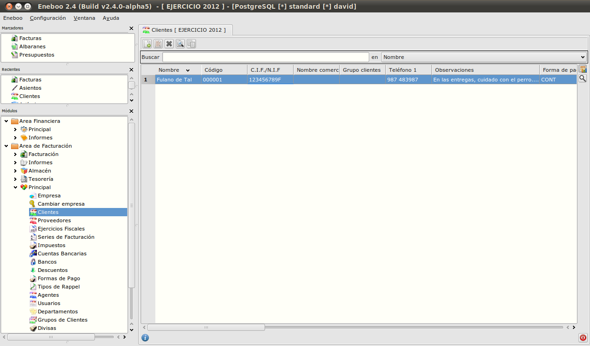

=============================
Primeros pasos
=============================

Instalación
-------------------

Instalador automático
""""""""""""""""""""""""""

Este instalador permite que en pocos minutos Eneboo Standard esté listo para trabajar. El instalador realiza las siguientes tareas de forma automática:

    * Instala el motor de Eneboo.
    * Instala el gestor de bases de datos PostgreSQL con la configuración por defecto.
    * Carga los módulos y extensiones del proyecto Eneboo Standard.
    
Se puede descargar en el apartado `Versiones Estables`_ del área de descarga de Eneboo. Buscaremos el *Windows Installer Quick* que mejor se adapte a nuestras necesidades (Windows o Linux, 32 ó 64 bits).

De momento no hay instalador automático para Mac.

Instalación manual
"""""""""""""""""""""""""

**Macintosh**

    #. Descargar y descomprimir el `motor de Eneboo para Mac OS X <http://eneboo.com/pub/eneboo/builds/v2.4.0/eneboo-v2.4.0-alpha5-mac32.zip>`_ (sólo para 32 bits).
    #. Descargar e instalar el gestor de bases de datos PostgreSQL (recomendamos la versión 8.4) para Mac del `área de descarga de PostgreSQL`_. La instalación solicitará un usuario y una contraseña de administrador de la base de datos que conviene anotar, ya que serán necesarios más adelante.
    #. Descargar el `paquete de Eneboo Standard`_.
    #. `Cargar el paquete de Eneboo Standard`_.
    
**Linux**

    #. Descargar y descomprimir el motor de Eneboo para Linux en el apartado `Versiones Estables`_. Buscaremos el *Build dbAdmin Linux* de 32 o 64 bits.
    #. Descargar e instalar el gestor de bases de datos PostgreSQL (recomendamos la versión 8.4) para Linux del `área de descarga de PostgreSQL`_. La instalación solicitará un usuario y una contraseña de administrador de la base de datos que conviene anotar, ya que serán necesarios más adelante.
    #. Descargar el `paquete de Eneboo Standard`_.
    #. `Cargar el paquete de Eneboo Standard`_.

Cargar el paquete de Eneboo Standard
"""""""""""""""""""""""""""""""""""""""""

    #. Abrir Eneboo. Aparecerá la pantalla *Conectar*.
    #. Rellenar los campos con los siguientes valores:
    
        * Base de datos: standard
        * Usuario: el administrador de la base de datos PostgreSQL.
        * Contraseña: la del administrador de la base de datos PosgtreSQL.
        
    #. Pulsar el botón de la flecha hacia la derecha *Más opciones*.
    #. Rellenar los campos de esta pantalla con los siguientes valores:
    
        * Controlador: PosgtreSQL
        * Servidor: localhost
        * Puerto: 5432
        
       .. figure:: images/conectar.png
           
           Pantalla *Conectar*
           
     #. Pulsar el botón *Conectar*. Se mostrará un mensaje con el texto *La base de datos standard no existe ¿Quiere crearla?*. Pulsar *Sí*.
     #. Se iniciará el programa y se mostrará el entorno Eneboo. En el área de *Módulos* de la parte izquierda, abrir la opción *Sistema -> Administración -> Cargar Paquete de módulos*.
     #. Localizar el archivo ``standard.eneboopkg`` y pulsar *Abrir*. Cuando finalice la carga, Eneboo Standard estará listo para empezar a trabajar.

Configuración inicial
-----------------------

Datos de la empresa
"""""""""""""""""""""""

    #. Abrimos la opción de menú *Área de Facturación > Principal > Empresa*.
    #. Sustituimos los datos que aparecen por los de nuestra empresa.

Entorno Eneboo
-------------------

El entorno de trabajo Eneboo consiste en un *menú de opciones* situado a la izquierda y un *área de datos* situado a la derecha.

   
   El entorno Eneboo.

El menú de opciones
""""""""""""""""""""""

Aquí podemos encontrar todas las opciones y funciones de Eneboo. Para abrir cada una haremos doble clic con el botón izquierdo del ratón sobre ellas. La pantalla correspondiente a la opción seleccionada se abrirá en el área de datos.

En la vista *Módulos* podemos encontrar todas las opciones. La vista *Recientes* se irá rellenando automáticamente con las últimas opciones usadas. En la vista *Marcadores* podemos situar las opciones que usamos con más frecuencia. Para hacerlo, localizamos una opción en la vista *Módulos*, hacemos clic derecho y seleccionamos *Añadir a marcadores*.

Cómo crear una factura de venta
------------------------------------

En esta sección veremos cómo crear una factura de venta para un cliente.

Crear la factura directamente
"""""""""""""""""""""""""""""""

#. Hacemos doble clic en la opción de menú *Area de Facturación -> Facturación -> Facturas*.
#. Pulsamos en el botón *Insertar registro (A)*.
    .. figure:: images/btn_insertar_registro.png
#. Para seleccionar un cliente, pulsamos el botón con el icono de la lupa que hay a la derecha de *Cliente*. Aparecerá la lista de clientes. Pulsamos de nuevo *Insertar registro (A)*. Aparecerá una ficha de cliente vacía.
#. Rellenamos al menos los campos obligatorios (marcados con asterisco).
#. Para rellenar la dirección de facturación, pulsamos el botón *Insertar*, rellenamos los campos y pulsamos el botón *Aceptar los cambios y cerrar formulario (F10)* (el que está en la parte inferior derecha de la pantalla con un icono de un aspa verde).
    .. figure:: images/editar_direcciones_clientes.png

Cómo introducir una factura de compra
------------------------------------------

.. _`Versiones Estables`: http://www.eneboo.org/site/stable
.. _`área de descarga de PostgreSQL`: http://www.enterprisedb.com/products-services-training/pgdownload
.. _`paquete de Eneboo Standard`: http://www.eneboo.com/pub/contrib/standard-modules/standard.eneboopkg
